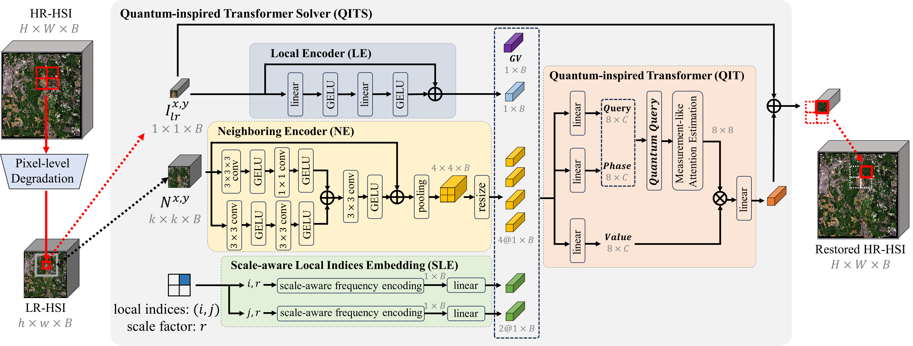

Quantum-Inspired Transformer Solver for Pixel-Level Arbitrary-Integer-Scale Hyperspectral Image Super-Resolution
===

Jie Zhang, Yongshan Zhang, Jinkun You, Yicong Zhou*

### About the project
Thanks for your attention. This is the official repository for the paper "Quantum-Inspired Transformer Solver for Pixel-Level Arbitrary-Integer-Scale Hyperspectral Image Super-Resolution" (the title has not yet been determined). A pixel-level hyperspectral image super-resolution framework with a quantum-inspired Transformer is proposed in this project. The source code will be available after the paper is accepted.

### Proposed framework

### Submission History
* [23/2/2024]reject by IJCAI'24  
* [17/1/2024]submit to IJCAI'24
